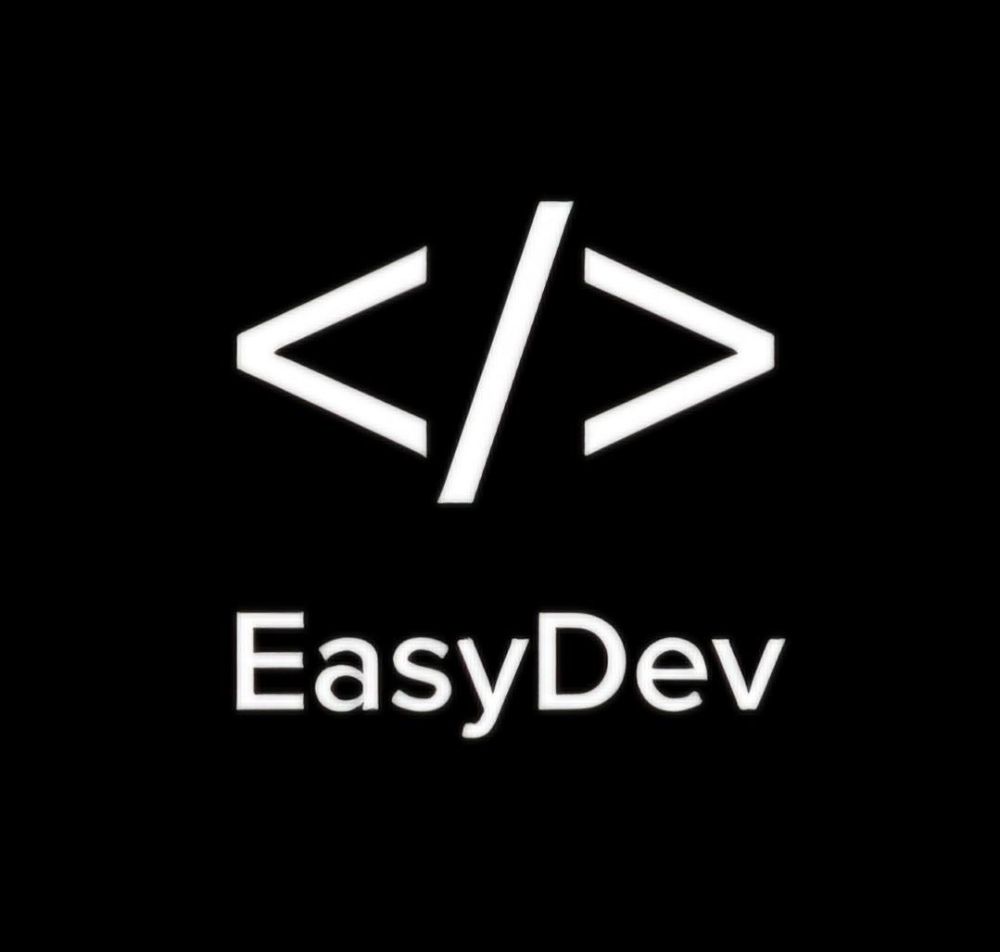
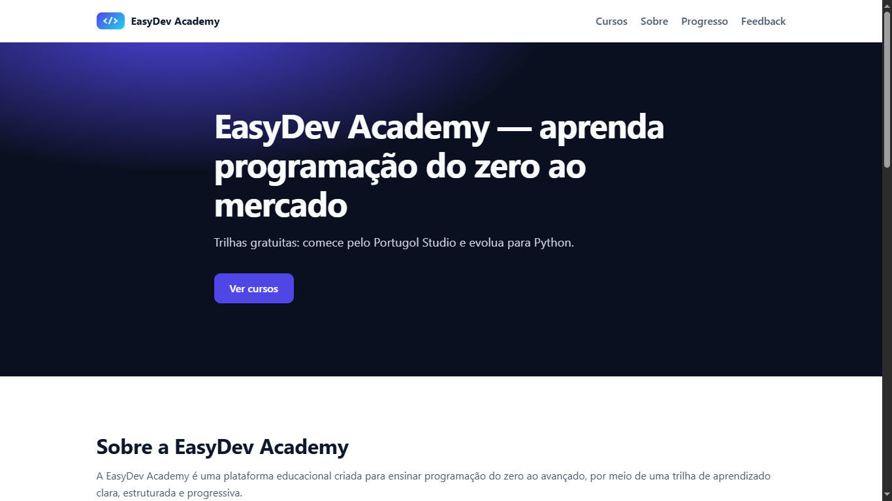
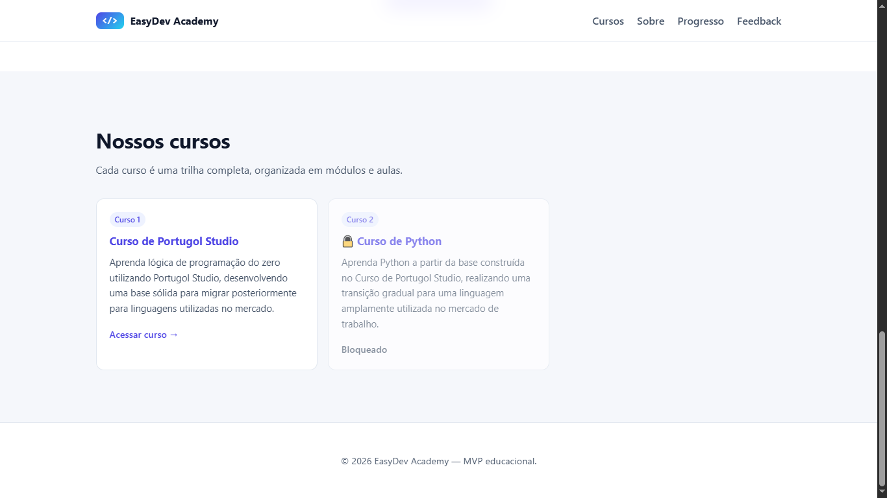
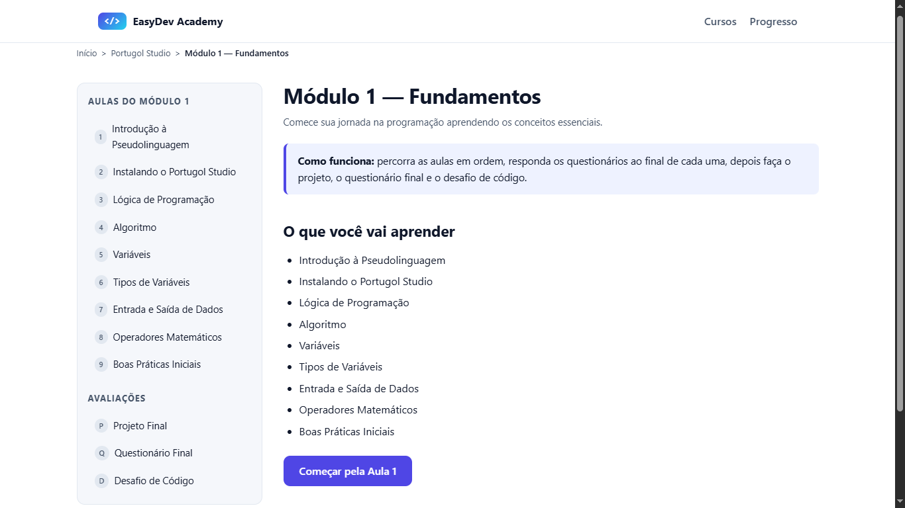

<div align="center">


<br /><br />

<!-- Banner do projeto — substitua pelo banner real -->


<br />

# EasyDev Academy

**Aprenda programação de forma prática, organizada e acessível.**  
Uma plataforma de ensino online criada para quem está começando do zero.

<br />

[🚀 Acessar a Plataforma](#-acesse-a-plataforma) &nbsp;·&nbsp;
[✨ Funcionalidades](#-funcionalidades) &nbsp;·&nbsp;
[🛣️ Roadmap](#️-roadmap) &nbsp;·&nbsp;
[👨‍💻 Autor](#-autor)

</div>

---

## 📋 Índice

- [O que é a EasyDev Academy](#-o-que-é-a-easydev-academy)
- [Funcionalidades](#-funcionalidades)
- [Demonstração](#-demonstração)
- [Tecnologias](#️-tecnologias)
- [Acesse a Plataforma](#-acesse-a-plataforma)
- [Estrutura dos Cursos](#-estrutura-dos-cursos)
- [Roadmap](#️-roadmap)
- [Autor](#-autor)

---

## 📖 O que é a EasyDev Academy

A **EasyDev Academy** é uma plataforma de ensino online desenvolvida para tornar o aprendizado de programação mais **acessível, organizado e prático** — especialmente para quem está dando os primeiros passos na área.

A plataforma oferece cursos estruturados em módulos, com aulas, vídeos, explicações detalhadas, questionários, desafios de código e projetos práticos. Tudo pensado para que o aluno evolua de forma progressiva e consistente.

> Esta é a **versão 1.0** da plataforma. O primeiro módulo do primeiro curso está completamente disponível. Os demais módulos e cursos serão liberados nas próximas atualizações.

<br />

### Por que a EasyDev Academy?

| Problema comum | Como resolvemos |
|---|---|
| Conteúdo espalhado e desorganizado | Estrutura clara: curso → módulo → aula, tudo em um só lugar |
| Aprendizado só teórico, sem prática | Cada módulo inclui desafios de código e um projeto final |
| Plataformas difíceis para iniciantes | Interface limpa, intuitiva e acessível em qualquer dispositivo |
| Sem noção de progresso | Acompanhamento do progresso integrado por módulo |

---

## ✨ Funcionalidades

### Disponíveis agora

- ✅ Página inicial institucional
- ✅ Sistema de cursos estruturados por módulos
- ✅ Aulas com vídeos incorporados
- ✅ Explicações detalhadas por aula
- ✅ Questionários interativos com feedback imediato
- ✅ Exercícios práticos
- ✅ Desafios de código por módulo
- ✅ Projetos finais
- ✅ Sistema de acompanhamento de progresso
- ✅ Interface responsiva — funciona no desktop, tablet e celular
- ✅ Página de feedback integrada ao Google Forms

### Em desenvolvimento

- 🔄 Novos módulos e cursos
- 🔄 Melhorias de acessibilidade
- 🔄 Modo escuro

---

## 🎬 Demonstração

<div align="center">

| Página Inicial | Cursos | Aula |
|:---:|:---:|:---:|
|  |  |  |

</div>

---

## 🛠️ Tecnologias

A EasyDev Academy foi construída com tecnologias front-end modernas, priorizando leveza, desempenho e compatibilidade com todos os dispositivos.

<div align="center">

| Tecnologia | Finalidade |
|---|---|
|  | Estrutura e semântica das páginas |
|  | Estilização, design system e responsividade |
|  | Interatividade, lógica dos cursos e sistema de progresso |

</div>

A arquitetura foi desenvolvida com expansão em mente: o projeto está preparado para receber um backend futuramente sem grandes alterações na estrutura existente.

---

## 🌐 Acesse a Plataforma

A EasyDev Academy está disponível online e pode ser utilizada diretamente pelo navegador — sem instalação, sem cadastro, sem complicação.

<div align="center">

<!-- Substitua # pelo link real do GitHub Pages -->
[](https://samuel-alves-dev.github.io/easydev-academy/index.html)

</div>

> A plataforma é hospedada via **GitHub Pages** e funciona em qualquer navegador moderno (Chrome, Firefox, Edge, Safari).

---

## 📚 Estrutura dos Cursos

Todos os cursos seguem uma organização padronizada para garantir uma experiência de aprendizado consistente e progressiva:

```
Curso
└── Módulo
    ├── 📄 Aula
    ├── 🎬 Vídeo
    ├── 📝 Explicação detalhada
    ├── ❓ Questionário interativo
    ├── 💻 Desafio de Código
    └── 🏁 Projeto Final
```

Essa estrutura foi criada para que cada módulo seja completo por si só, permitindo que novos cursos sejam adicionados de forma ágil conforme a plataforma evolui.

---

## 🛣️ Roadmap

### v1.0 — Lançamento ✅

- [x] Plataforma front-end publicada
- [x] Primeiro módulo do primeiro curso completo
- [x] Questionários com feedback e sistema de progresso
- [x] Interface responsiva para desktop, tablet e mobile

### v1.x — Próximas atualizações 🔄

- [ ] Novos módulos e cursos
- [ ] Modo escuro
- [ ] Melhorias de acessibilidade (WCAG)
- [ ] Refinamentos gerais de interface e experiência

### v2.0 — Evolução da plataforma 📌

- [ ] Backend e contas de usuário
- [ ] Persistência de progresso entre sessões
- [ ] Dashboard personalizado do aluno
- [ ] Sistema de conquistas

### v3.0 — Futuro 🔭

- [ ] Integração com Inteligência Artificial para suporte aos estudantes
- [ ] Comunidade de alunos
- [ ] Aplicativo mobile

---

## 👨‍💻 Autor

<div align="center">

**Samuel Alves**

Desenvolvedor e criador da iniciativa **Samuel EasyDev** —  
onde ensino programação de forma simples e rápida.

<br />

[](https://github.com/Samuel-Alves-dev)
[](https://www.linkedin.com/in/samuel-alves-a986813ba?utm_source=share_via&utm_content=profile&utm_medium=member_android)
[](https://youtube.com/@SamuelEasyDev)
[](https://www.tiktok.com/@Samuel.EasyDev)

</div>

---

<div align="center">

Desenvolvido por **Samuel Alves** · Iniciativa [Samuel EasyDev](https://youtube.com/@SamuelEasyDev)

Se a plataforma foi útil para você, deixe uma ⭐ no repositório — isso ajuda o projeto a crescer!

</div>
